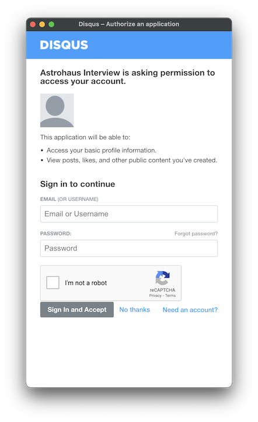
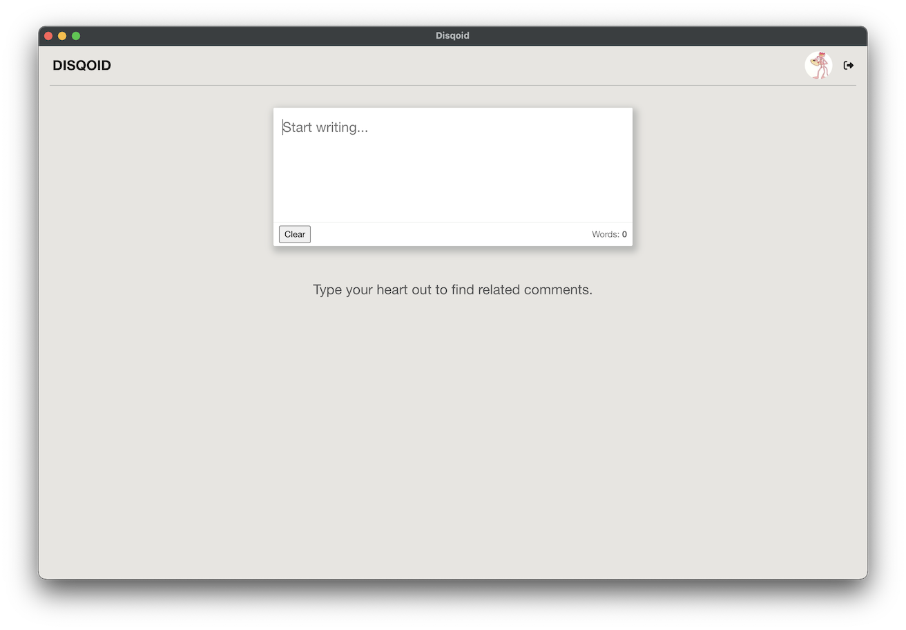
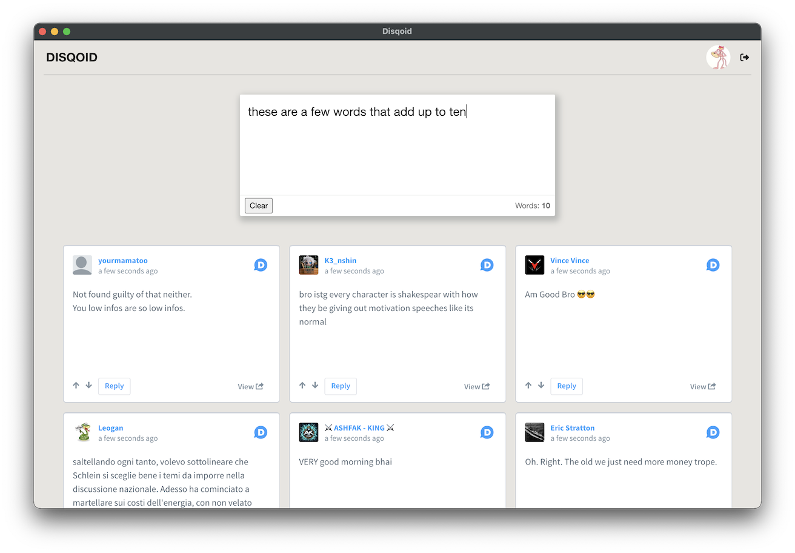

# Disqoid
An interview project that displays some Disqus comments after typing in a textarea.

To run, you will need a Disqus API key (both public and private). Once you have that,
expose them via environment variables, or create a `.env` file (see the `.env.example`):
```
DISQUS_API_KEY=<your public key>
DISQUS_API_SECRET=<your private key>
```

Then, make sure you have the latest Node installed and:
```bash
npm i
npm start
```

The app will present an OAuth2 flow for you to login with your Disqus account. This account does not need to be associated with the API account.

Once logged in, you should see your profile pic in the top right, and a textarea in the middle prompting you to type.

After you type increments of 10 words, it will fetch from the Disqus API.

## App Architecture

The frontend does not know it's running in Electron. To do this, I've spawned an ExpressJS API server from Electron and handed the API URL to the frontend (because the port is discovered). It then can make requests as normal. There's a small proxy to override requests, such as for the OAuth callback. See [main.ts](./src/main.ts) and [server.ts](./src/server.ts).

The words are counted via a Web Worker that's spawned with the new Worker Module feature. See [workers/text-analyzer.ts](./src/workers/text-analyzer.ts) and the [TextArea](./src/components/TextArea.tsx) component that uses it.

Importantly, the types are layered so that each layer of the architecture could be spawned/moved separately.

frontend :: api lib :: api server :: disqus api

## Tests

The tests use the new [Vitest](https://vitest.dev/) tool.

Run them with:
```bash
npm run test
```

## TODO

- [ ] React tests with [React Testing Library](https://testing-library.com/docs/react-testing-library/intro/)
- [ ] maybe [Storybook](https://storybook.js.org/) which is how I like to test and develop UI libraries
- [ ] do something interesting with the Disqus API instead of fetching random posts

## Screenshots

Auth screen:



After authenticated:


After a multiple of 10 words (the trigger):

